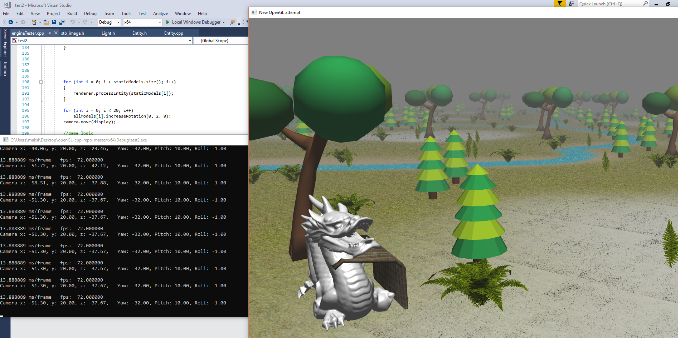

# openGL-cpp-repo
Self-Study OpenGL project.

- Purposes: Learning the following:
-rendering
-shaders
-mapping
- 3d graphics
-camera manipulation ("a,w,s,d" for x,z - axis movement, "e,q" for turning, "x,c" for y-axis movement)

Simply open with visual studio(tested on 2017) with c++ installed (might need to copy glew32.dll into build directory). 

